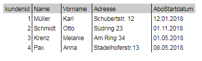
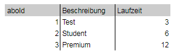
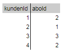
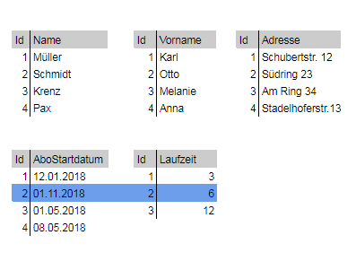

***

[<< zurück](02_toc.md)

***

# 5.3. Normalisierte Datenstruktur
Spaltenorientierte Datenbanken bevorzugen eine denormalisierte Datenstruktur. Wenn wir zum Beispiel in einer zeilenorientierten Datenbank ein Kundensystem für ein Zeitungsabonnement abbilden wollen, haben wir eine Tabelle für alle Kunden die eine bestimmte Form von Abonnement haben. Es gibt in diesem Beispiel die Abonnements “Premium, Student, Test”. Des Weiteren gibt es eine Tabelle mit den registrierten Kundendatensätzen, eine Tabelle mit der Auflistung welcher Kunde welches Abo seit wann hat und wie lang es läuft. Es könnte auch noch eine Tabelle geben, welche die zusätzlichen Einkäufe zum Abonnement erfasst, diese lassen wir aber für unser Beispiel ausser Betracht. Die Tabellen 2-4 in diesem Abschnitt zeigen die zum Beispielfall gehörigen Datenbanktabellen. Die Tabellen sind vereinfacht dargestellt und würden in der Praxis eher noch Referenzen zu Geodatenbanken etc. haben, für unser Beispiel reicht jeweils eine Tabelle mit Kundendaten, den angebotenen Abonnementformen und der Zuordnung welcher Kunde welches Abonnement hat. Dies erfolgt über eine Aggregationstabelle von kundenId und aboId.

 _Skizzenhafter Aufbau für das Beispiel eines Zeitungsabos in einem zeilenorientierten Datenbanksystem:_

   
Abbildung 11: Beispiel Kundentabelle für Anwendungsfall "Zeitschriften Abo"   

   
Abbildung 12: Beispiel Abonementtabelle für Anwendungsfall "Zeitschriften Abo"   

   
Abbildung 13: Beispiel Aggregationstabelle Kunde zu Abonnement   

Wird die Information benötigt, wann das Abonnement des Kunden mit der kundenId = 2 ausläuft benötigt man zwei Werte zur Berechnung des Enddatums. Aus der Kundentabelle das Startdatum des Abonnements und aus der Abonnementtabelle die Laufzeit. Hierfür muss erst die Aggregationstabelle gefragt werden welches Abonnement der Kunde mit der ID 2 hat. Mit der erhaltenen aboId = 1 kann nun die Standard Laufzeit des Abonnements (hier: 3 Monate) ausgelesen werden. Dann muss in der Tabelle Kundendaten auf das komplette Tupel zur kundenId = 2 abgefragt werden, um das Startdatum auszulesen. Nun kann aus _Startdatum + Laufzeit_ berechnet werden, dass der Vertrag zum 01.02.2019 ausläuft.
Für diesen Anwendungsfall ist ein zeilenorietniertes Datenbanksystem gut geeignet.

In einer spaltenorientierten Datenbank könnten die Daten wie ind er folgenden _Abbildung 14_ strukturiert sein:

   
Abbildung 14: Beispiel Spaltendarstellung für Anwendungsfall "Zeitschriften Abo"   

Hier gibt es fünf Spalten in der fünf verschiedene Informationen gespeichert sind. Der Index stellt die kundenId dar, für unser Beispiel ist also jeweils die 2. Zeile relevant. Die benötigten Werte zur Berechnung des Enddatums können mit einem Zugriff auf nur zwei Spalten ausgelsen werden, die Spalte _"AboStartdatum"_ und die Spalte _"Laufzeit"_. Die Datensätze zu Name, Vorname und Adresse werden nicht benötigt und daher muss auf die entsprechenden Dateien nicht zu gegriffen werden, es werden nur relevante Spalten abgefragt.
Einen wirklichen Vorteil bietet dies, wenn das Unternehmen beispielsweise herausfinden möchte, wann die meisten Verträge geschlossen werden und von welcher Abonnementart diese sind.

Es könt auch in einer spaltenorientierten Datenbank eine einzige Tabelle die Informationen mit den Kundendaten und den Einkäufen abbilden.
Die Normalisierung der Daten macht es in zeilenorientierten Datenbanken schneller Daten zu aktualisieren, da man dann beim Aktualisieren von Kundendaten nur an einer Stelle ändern muss und alle anderen Transaktionen beziehen sich die Aktualisierung aus der einen Zelle. In der spaltenorientierten Datenbank würde man die Kundendaten zusammen mit den zusätzlichen Einkäufen speichern und müsste dann um beispielsweise die Adresse zu aktualisieren, an mehreren Stellen die Aktualisierung vornehmen.

Man kann auch in einer zeilenorientierten Datenbank Datenanalysen machen. Diese Analyse läuft im Zweifel nur langsamer, als sie in einer spaltenorientierten Datenbank brauchen.  
Wenn nur einige wenige Felder einer Wide Table Datenstruktur gebraucht werden sind Column Stores das Richtige. Sie sollten jedoch nicht für normale Online Transactional Processing (OLTP) verwendet werden. Will man etwas wie `SELECT * FROM TABLE` machen, dann ist eine spaltenorientierte Datenbank, bei der alle Tabellenspalten in separate Dateien gespeichert werden, nicht geeignet, da man auf unzählige Dateien zugreifen muss, um die Abfrage auszuführen. Für Dienste die Online Analytical Processing (OLAP) Anwendungen unterstützen sollen, bieten Column Stores in Verbindung mit den in Abschnitt 4.4 beschriebenen Kompressionsverfahren eine hohe Performancesteigerung. In (FEHLT HIER  INHALTE?) [MG15]

Zeilenorientierte Datenbanken sind in der Regel dafür gemacht schnell bestimmte Daten abzurufen und Transaktionen darauf auszuführen, also schreibend auf die Datenbank zuzugreifen. Spaltenorientierte Datenbank wurden entwickelt, um schnell analytische Statistiken zu erheben und auf einer großen Menge von spezifischen Daten zu einer Information auszuwerten.

Wenn wir beispielsweise nicht wissen wollen, welche Haustiere ein bestimmter User hat, sondern welches Haustier die Deutschen am häufigsten haben, dann fragen wir nur die Information Haustiere ab und nicht das Tupel, welches alle Informationen zu einem bestimmten User darstellt, nur um dann zu schauen was in der Zelle “Haustiere” steht.

***

[<< Datenstruktur](07-3_normalized_data-structure.md) | [Anwendungsbeispiele >>](08_use_cases.md)

***